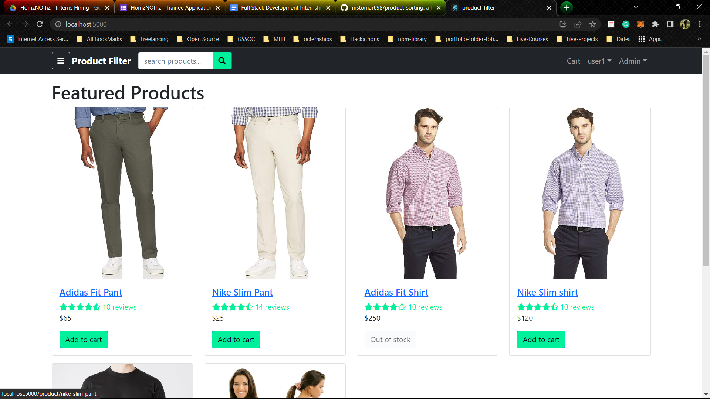
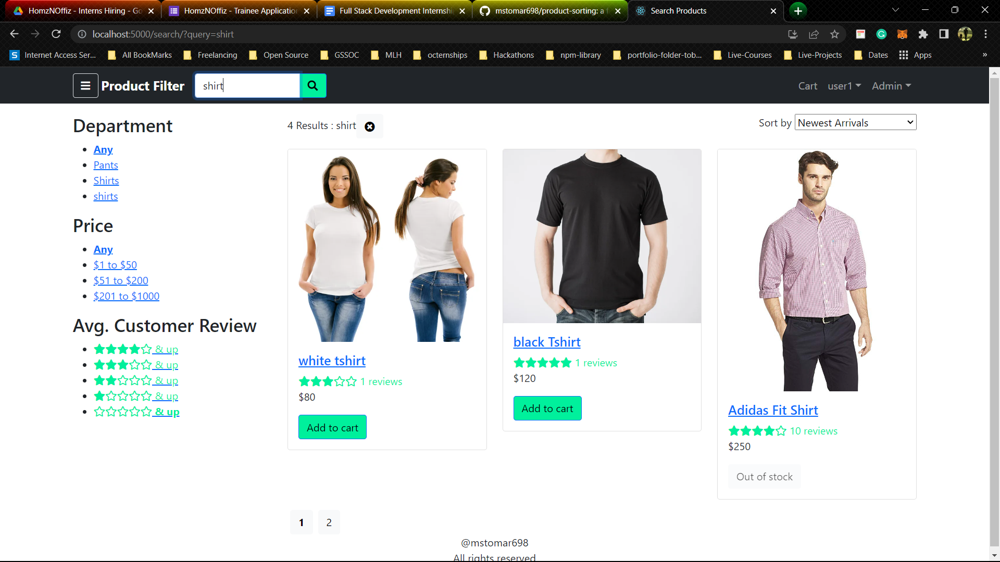
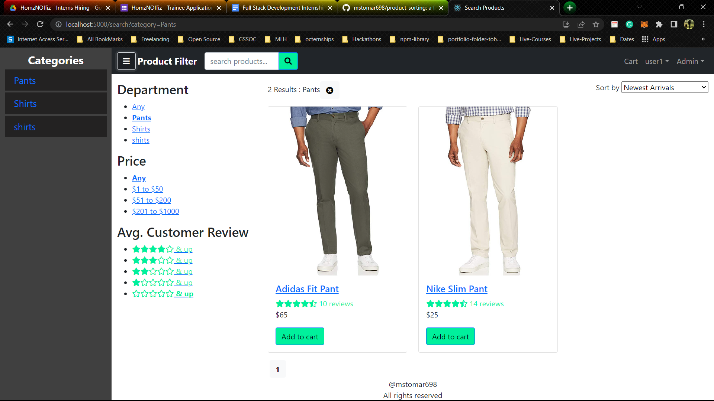
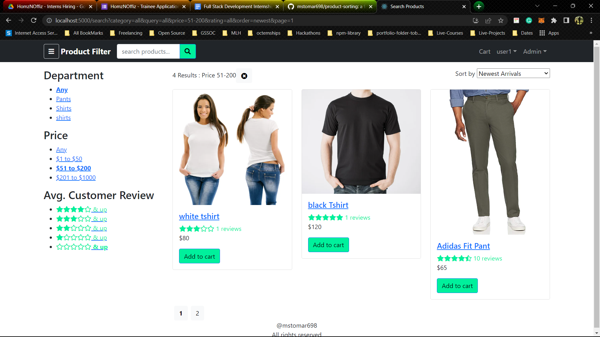
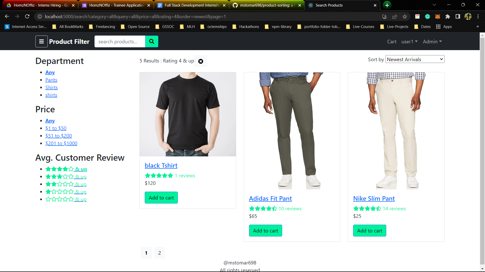

# Product Sorting

- A simple product filter application using MERN stack.
- It allows user to filter listed products based on price, category and ratings of the product.
- It also have inbuilt pagination feature to display products in chunks.
- It allows users to search product by name.
- Search results are also paginated and can be filtered by price, category and ratings.

### Tech Stack

```sh
frontend: ReactJS, bootstrap, react-router-dom, axios, react-taostify
backend: NodeJS, ExpressJS, MongoDB, jsonwebtoken, bcryptjs
```

> See [INFO](INFO.md) for more details about tech stack.

### Installation

```sh
# Clone the repository
git clone https://github.com/mstomar698/product-sorting.git
# Change directory
cd product-sorting
# Install dependencies and build project
npm run build
# Run the project
npm run start
# Open localhost:5000 in browser and VOILA!!
```

> See walk through [video](https://drive.google.com/file/d/1H_lyS9xxzV98yRi_S5UEFv4D1OySRoC5/view?usp=sharing) for more details.

> Other docs are present at [docs](https://drive.google.com/drive/folders/1jiF38NZomdoPir12dPP8IfZnyIi1gYql?usp=sharing) folder.

### Screenshots







### Problems faced

- I had hard time conneting mongoDB to backend.
- later, it took too much time to connect frontend to backend.
- similarly i had to spend a lot of time to implement pagination.
- finally, running whole project from single command was a challenge.

### License

[MIT](LICENSE)
